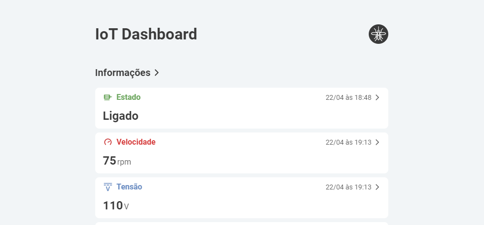
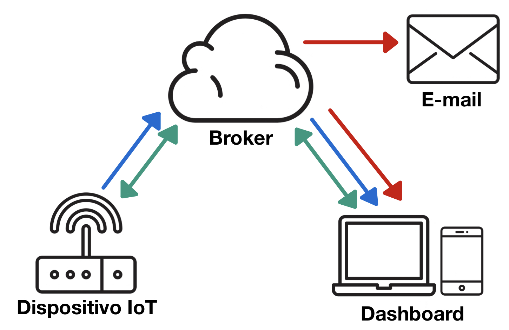

# IoT Dashboard
<!-- Veja https://shields.io -->
> Este projeto se trata de um dashboard interativo para aplicações IoT utilizado no trabalho de conclusão de curso (TCC) do aluno Felipe Pimenta Bernardo, em conjunto com o aluno Flávio Alegretti Ramos, orientados pelo professor Dr. José Roberto Boffino de Almeida Monteiro.



## 🚀 Próximas tarefas

O projeto ainda está em desenvolvimento e as próximas atualizações serão voltadas nas seguintes tarefas:

- [X] Layout inicial
- [X] Conexão com o broker
- [X] Recebimento dos dados
- [ ] Envio de publicações
- [ ] Informações detalhadas e gráficos
- [ ] Testes unitários
- [ ] Testes e2e

## 💻 Rodando o projeto
Primeiramente, verifique se o seu computador possui o [node](https://nodejs.org/pt-br) na versão 16.xx.xx e o [npm](https://www.npmjs.com/) na versão 8.xx.xx. Após clonar o projeto em seu computador, as dependências podem ser instaladas com o comando:
```
npm install
```
Rodando localmente em modo de desenvolvimento
```
npm run dev
```
Rodando localmente expondo para a rede local
```
npm run serve
```
Fazendo a build para produção
```
npm run build
```

## 🛠️ Tecnologias
Este projeto foi criado utilizando o framework **Vue 3**, com **TypeScript** para tipagem. Para testes unitários foi escolhido o **Vitest**. Para testes *End-to-End* (E2E) foi escolhido o **Cypress**. O projeto conta também com **Vue Router** para roteamento de páginas e **Pinia** para gerenciamento de estados.

## ☕ Arquitetura


### Estrutura de tópicos do broker
```
/motor
├── /estado
├── /velocidade
├── /tensao
├── /corrente
├── /temperatura
└── /avisos
```
 
#### Unidirecionais ⟹

#### Bidirecionais ⟺

#### Exclusivos ⟾

#### Estado
O tópico `/estado` se refere ao estado do motor, i.e., ligado ou desligado. Possui dois subtópicos: `/atual` e `/meta`.

## 🤝 Colaboradores

<table>
  <tr>
    <td align="center">
      <a href="https://www.linkedin.com/in/felipepimentab/">
        <br>
        <sub>
          <b>Felipe Pimenta</b>
        </sub>
      </a>
    </td>
    <td align="center">
      <a href="https://www.linkedin.com/in/flavioalegretti/">
        <br>
        <sub>
          <b>Flávio Alegretti</b>
        </sub>
      </a>
    </td>
    <!-- <td align="center">
      <a href="#">
        <br>
        <sub>
          <b>Zé</b>
        </sub>
      </a>
    </td> -->
  </tr>
</table>